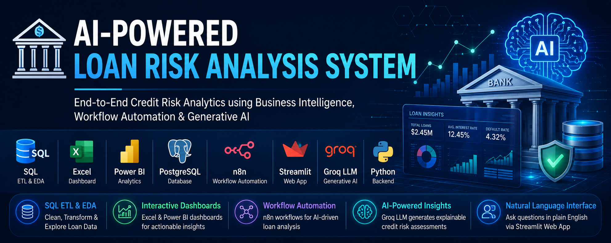
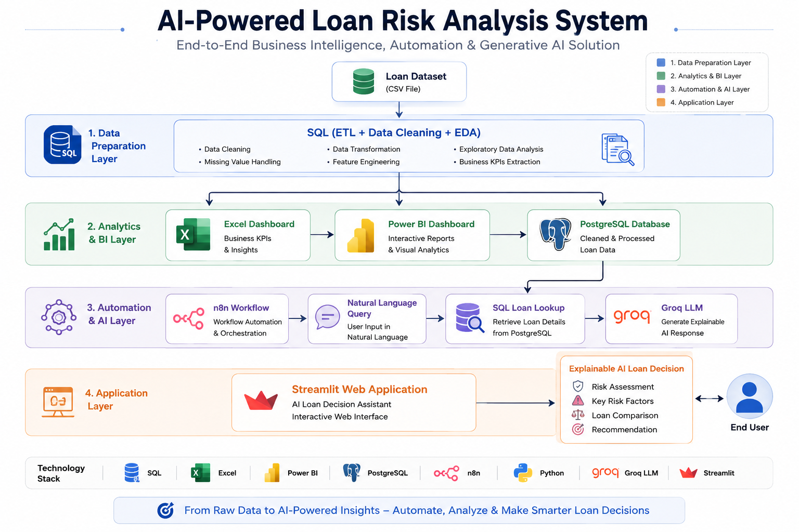
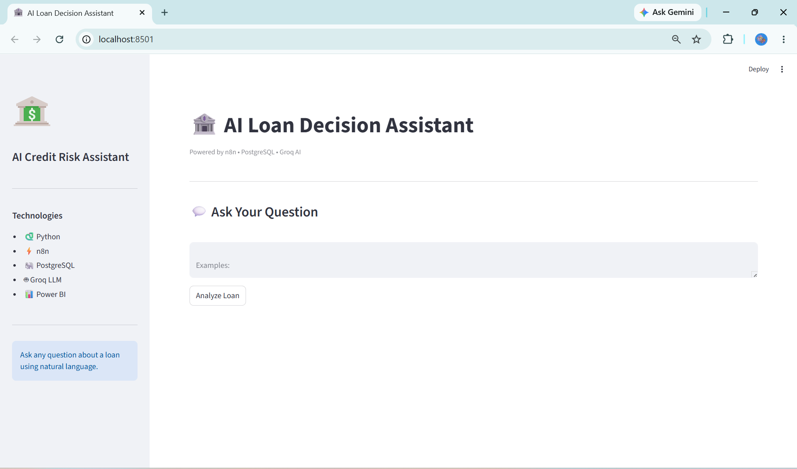
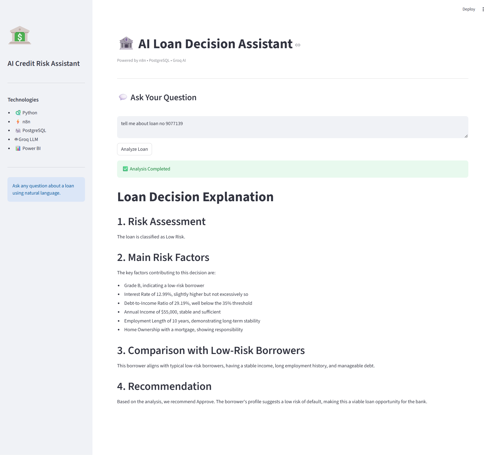

# AI-Loan-Risk-Analysis-System
### AI-powered Loan Decision Support System built with SQL, Power BI, n8n, Streamlit, PostgreSQL, and Groq LLM.

## An end-to-end AI-powered Loan Risk Analysis System that combines SQL-based ETL, Business Intelligence (Excel & Power BI), Workflow Automation (n8n), PostgreSQL, and Generative AI (Groq LLM) to deliver explainable credit risk assessments through a natural language interface.

  

## 📖 Project Overview

This project demonstrates an end-to-end AI-powered Loan Risk Analysis System that combines Business Intelligence, Workflow Automation, Relational Databases, and Generative AI.

The project begins with SQL-based ETL and Exploratory Data Analysis, followed by interactive dashboards in Excel and Power BI. Finally, an AI-powered application was developed using n8n, PostgreSQL, Groq LLM, and Streamlit, enabling users to query loan information in natural language and receive explainable credit risk assessment

## 🏗️ System Architecture

  

## 🔄 Project Workflow

Raw Dataset
      ↓
SQL (ETL + EDA)
      ↓
Excel Dashboard
      ↓
Power BI Dashboard
      ↓
n8n Workflow
      ↓
PostgreSQL
      ↓
Groq AI
      ↓
Streamlit Web App

## 🎯 Problem Statement

Financial institutions need efficient methods to evaluate borrower risk and explain lending decisions.

Traditional dashboards provide insights but cannot answer natural language questions.

This project bridges that gap by combining Business Intelligence with Generative AI, allowing users to interact with loan data conversationally.

## ✨ Features

- SQL-based ETL pipeline
- Exploratory Data Analysis using SQL
- Excel Dashboard
- Interactive Power BI Dashboard
- PostgreSQL Database
- AI Workflow Automation using n8n
- Natural Language Loan Query
- Explainable AI Loan Analysis
- Streamlit Web Interface

## 🛠 SQL ETL & Exploratory Data Analysis

Performed:

- Data Cleaning
- Missing Value Handling
- Feature Engineering
- Exploratory Data Analysis
- Business KPI Extraction

## 🤖 AI Workflow

The AI workflow was built using n8n.

Workflow Steps:

1. User enters a natural language query.
2. AI extracts Loan ID.
3. PostgreSQL retrieves borrower details.
4. Groq LLM generates explainable credit risk analysis.
5. Streamlit displays the response.

## Streamlit

# 🚀 Project Demo

The Streamlit application allows users to query loan decisions using natural language. It communicates with an automated n8n workflow, retrieves loan information from PostgreSQL, and generates AI-powered explanations using Groq LLM.

## 🏠 Streamlit Home Page

  

## 🤖 AI Loan Decision Explanation

  

## 🚀 Future Enhancements

- Deploy on AWS / Azure
- Authentication
- Multi-user support
- Loan recommendation engine
- Predictive ML model integration
- Chat history

## 👨‍💻 Author

**Tanmay Gautam**

https://www.linkedin.com/in/tanmay-gautam-59443b23/

tanmayg19@gmail.com  

