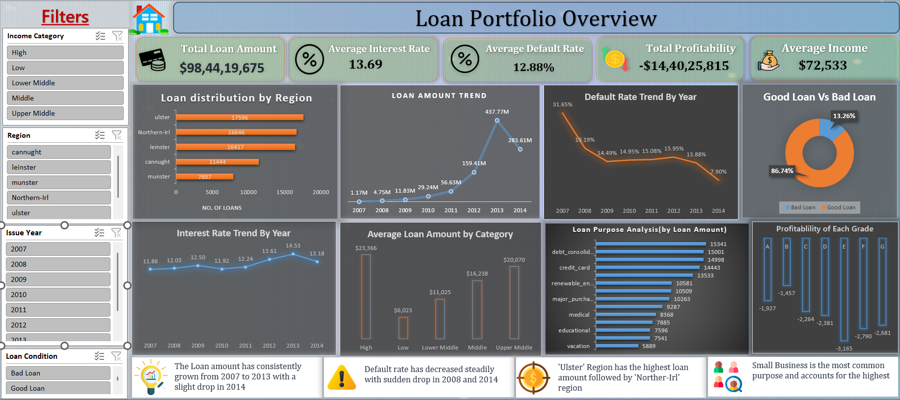
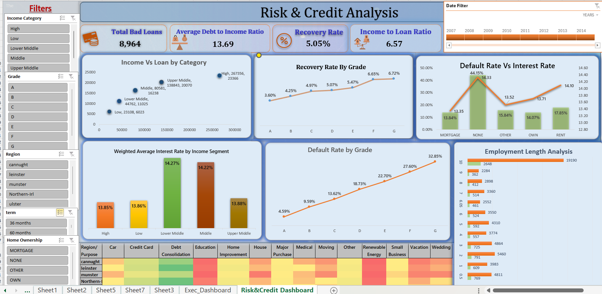
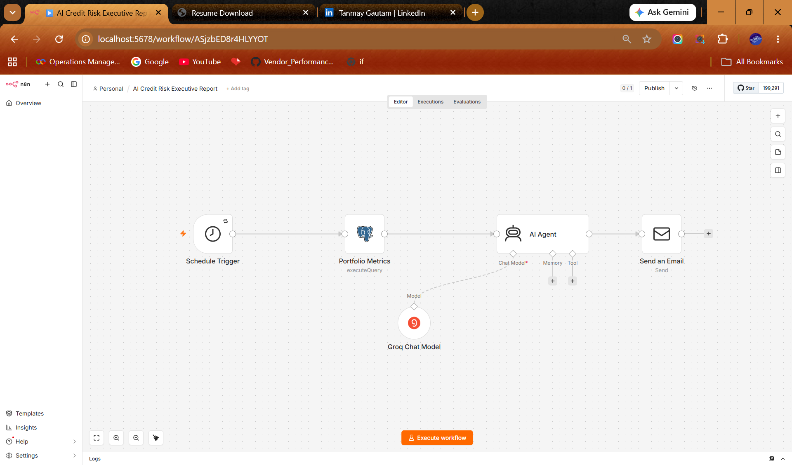
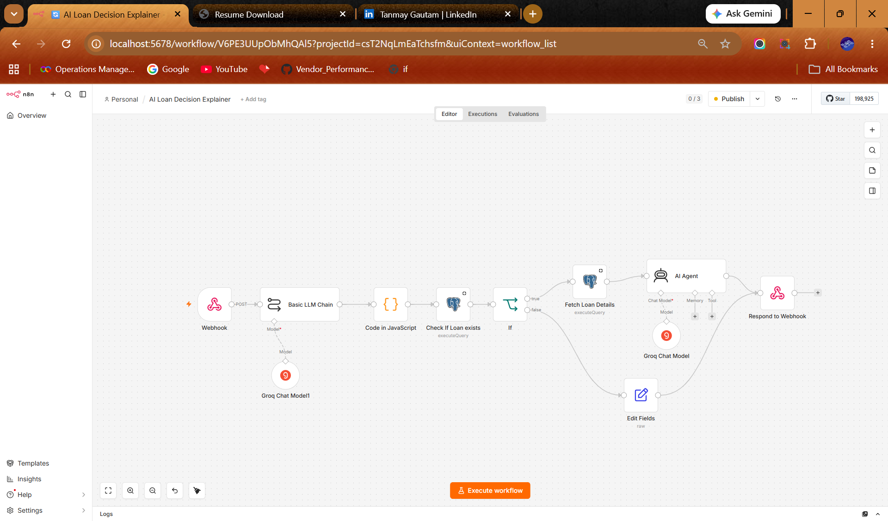

# AI-Loan-Risk-Analysis-System
### AI-powered Loan Decision Support System built with SQL, Power BI, n8n, Streamlit, PostgreSQL, and Groq LLM.

## An end-to-end AI-powered Loan Risk Analysis System that combines SQL-based ETL, Business Intelligence (Excel & Power BI), Workflow Automation (n8n), PostgreSQL, and Generative AI (Groq LLM) to deliver explainable credit risk assessments through a natural language interface.

  

## 📖 Project Overview

This project demonstrates an end-to-end AI-powered Loan Risk Analysis System that combines Business Intelligence, Workflow Automation, Relational Databases, and Generative AI.

The project begins with SQL-based ETL and Exploratory Data Analysis, followed by interactive dashboards in Excel and Power BI. Finally, an AI-powered application was developed using n8n, PostgreSQL, Groq LLM, and Streamlit, enabling users to query loan information in natural language and receive explainable credit risk assessment

## 🏗️ System Architecture

  

## 🔄 Project Workflow

Raw Dataset
      ↓
SQL (ETL + EDA)
      ↓
Excel Dashboard
      ↓
Power BI Dashboard
      ↓
n8n Workflow
      ↓
PostgreSQL
      ↓
Groq AI
      ↓
Streamlit Web App

## 🎯 Problem Statement

Financial institutions need efficient methods to evaluate borrower risk and explain lending decisions.

Traditional dashboards provide insights but cannot answer natural language questions.

This project bridges that gap by combining Business Intelligence with Generative AI, allowing users to interact with loan data conversationally.

## ✨ Features

- SQL-based ETL pipeline
- Exploratory Data Analysis using SQL
- Excel Dashboard
- Interactive Power BI Dashboard
- PostgreSQL Database
- AI Workflow Automation using n8n
- Natural Language Loan Query
- Explainable AI Loan Analysis
- Streamlit Web Interface

---

# 📈 Excel Dashboard

The project includes interactive Excel dashboards used during the exploratory analysis stage before building the Power BI solution.

## Dashboard 1

  

---

## Dashboard 2

  

---

# 📥 Download Project Files

Some project files exceed GitHub's recommended file size limit. They are available through Google Drive.

| File | Download |
|------|----------|
| 📊 Excel Dashboard | [[Download Excel Workbook]([https://docs.google.com/spreadsheets/d/11cXF4Ua8mLVkCmEq2auOLMJTHj2kYTmd/edit?usp=drive_link&ouid=104471324997452006420&rtpof=true&sd=true]

---

# 📊 Power BI Dashboard

The Power BI solution transforms the cleaned loan dataset into interactive dashboards that provide comprehensive insights into portfolio performance, credit risk, and customer behavior.

---

## 📌 Portfolio Overview

This dashboard provides a high-level view of the overall loan portfolio, highlighting key business KPIs, lending trends, and portfolio performance.

  

---

## ⚠️ Credit & Risk Analysis

This dashboard focuses on borrower risk profiles, loan performance, and credit quality, helping identify potential risk areas and support informed lending decisions.

  

---

## 👥 Customer Insights

This dashboard analyzes customer demographics, loan behavior, and borrower characteristics, enabling deeper understanding of customer segments and lending patterns.

  

## 🛠 SQL ETL & Exploratory Data Analysis

Performed:

- Data Cleaning
- Missing Value Handling
- Feature Engineering
- Exploratory Data Analysis
- Business KPI Extraction

## 🤖 AI Workflow

The AI workflow was built using n8n.

Workflow Steps:

1. User enters a natural language query.
2. AI extracts Loan ID.
3. PostgreSQL retrieves borrower details.
4. Groq LLM generates explainable credit risk analysis.
5. Streamlit displays the response.

---

# ⚡ Workflow Automation using n8n

The AI automation layer was developed using **n8n**, enabling seamless integration between PostgreSQL, Groq LLM, and the Streamlit application.

The workflows automate loan data retrieval, natural language processing, AI-powered risk explanation, and user response generation.

---

## 🔄 Workflow 1 – AI Loan Analysis Workflow

This workflow receives a natural language query, extracts the Loan ID, retrieves loan information from PostgreSQL, and prepares structured data for AI processing.

  

---

## 🤖 Workflow 2 – AI Loan Decision Explanation Workflow

This workflow generates explainable loan risk assessments using **Groq LLM**, validates loan records, handles invalid loan IDs, and returns structured responses to the Streamlit web application.

  

## Streamlit

# 🚀 Project Demo

The Streamlit application allows users to query loan decisions using natural language. It communicates with an automated n8n workflow, retrieves loan information from PostgreSQL, and generates AI-powered explanations using Groq LLM.

## 🏠 Streamlit Home Page

  

## 🤖 AI Loan Decision Explanation

  

## 🚀 Future Enhancements

- Deploy on AWS / Azure
- Authentication
- Multi-user support
- Loan recommendation engine
- Predictive ML model integration
- Chat history

## 👨‍💻 Author

**Tanmay Gautam**

https://www.linkedin.com/in/tanmay-gautam-59443b23/

tanmayg19@gmail.com  

